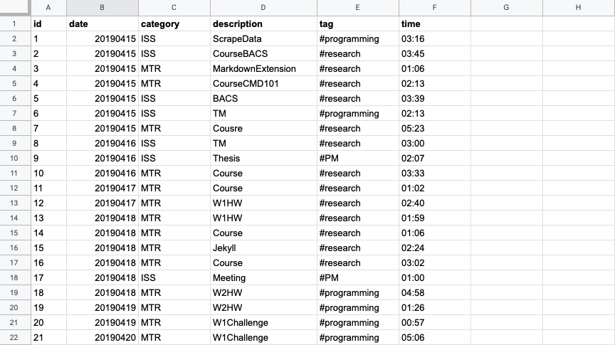

# Side Project - Time Log Web Version 
紀錄這次導師計畫的時間，並且分析自己的工作狀況。

## 第一版 Shell Script 

在 [week5 複習週](../../week5/hw1.md)的時候提過，簡言之就是手動用免費 Timely 回顧今天時間使用狀況，然後記錄在檔案裡面，然後用 shell script 來計算工作時數。

## 第二版 Javascript + Google Sheet API 

隨著課程學到了新東西，當然計畫中使用的工具也要跟著課程與時俱進（？）

這次利用 google sheet 當作 database ，練習使用 google api 來取得資料做數字統計。

過程中最艱難的就是學習使用 google API 以及時間處理。

1. Google API
遙遠以前，我使用 airtable + workflowy 做過一些小東西，結果 google API 的複雜指數根本不可同日而語。

Google API 有兩層事情要處理，Auth 跟 API 的學習，API 倒是還好，因為資料量不是很大，所以這邊是直接一次性的抓下所有資料在做分類。

而 Auth 則是參考 google tutorial 上的程式碼進行修改使用，但底層原理還不是很了解。 

2. 時間處理
自己平常紀錄時間的習慣是以 `YYYYMMNN` 的方式在紀錄，但這不是標準規格的時間格式，所以這邊利用 `new Date()` 然後做資料型態轉變，再來做時間的判斷。

這次的挑戰是第一次一開始就用物件導向來寫程式，有別於前幾週重構的練習，是先基於自己改過的程式再來修改，這次一開始就要規劃。

最後用篩選後選取的內容（類似 SQL 的 SELECT）作為物件來進行操作，過程中也開發了物件的新面向，過去在用一些 method 習慣 `.method().method()` 這樣的作法是怎麼實作的呢？只要讓 method return instance 就可以了，利用這種方法又更精簡了寫法。

其實就算有規劃了，但還是不夠好，而且擴充性還不夠，這一版完成後覺得也許應該要有一個 parent class Time 專門處理時間，然後讓 filter extends 這樣未來要擴充其他時間功能 e.g. 顯示連續每天的時間狀況等等的，應該會變得容易很多。

未來計畫加入視覺化跟輸入的部分。

## 第三版
1. 換 air table api 開放大家都可以使用
2. Date Object 優化
3. D3 visualization 
4. 畫面優化

