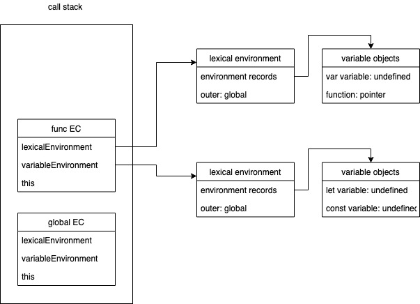

## 這週學了一大堆以前搞不懂的東西，你有變得更懂了嗎？請寫下你的心得。

關於 javascript 原理有很多文章討論了 Execution Context（EC） 又進一步討論 EC 怎麼影響 Hoisting, Closure，甚至再之後誕生了 Lexical Environment 的概念，但從 ES3 一路到 ES6 有許許多多新概念出現，卻越來越難以貫穿全程了解具體流程怎麼運作，所以才有這麼一個小鎮故事誕生，希望可以透過故事釐清幾件事情：

1. 名詞釐清
2. Execution Context 建立過程 
3. Hoisting, Closure 與 Scope Chain 怎麼發生

# 在一個不太起眼也不算繁華的小鎮（喂）

在誰都不知道的平行世界裡面，有一個小小的城鎮叫做自由鎮，由於小鎮內各地故事多、風景佳、又有各種就業機會，是一個每年會有很多外地人來來往往的一個自由小鎮。每個人在小鎮都有自己的小小目標，他們完成目標後就會離開這個小鎮。

正因如此，小鎮的人口流動非常複雜，鎮長為了守護小鎮的和平，並沒有使用化學物 X 而是選擇發展出了一套管理人口的機制，來管理在地居民跟來來往往的旅客，避免讓邪惡混入小鎮之中，並分別設置了幾個單位來負責管理這件事情。

# 鎮長的妙想

一開始呢，鎮長也很煩惱，到底怎麼登記人口比較好，因為如果資料收得多呢？下面的人處理起來又慢；資料收得少呢？出了事找不到人，最後鎮長決定，最起碼在一入小鎮的時候，要知道他會「在哪裡」跟「基本個人資訊」，這樣他才知道是誰又在哪裡做了什麼事，才能判斷是不是有違法之虞。

同時間，又成立了人口總局，旗下有兩個窗口民政局跟海關處，負責登記小鎮內跟外地來的旅客的資訊，讓小鎮內跟小鎮外的資料區分清楚。除了非鎮內鎮外，人口也很複雜，像是：目的不同，有些人就是來購物的、有些人是來工作的；或人數不同，有些是一團旅行團來的、有些是背包客；甚至歸屬不同，有些背包客跟著旅行團來但只是跟著機加酒、有些又真的是在旅行團之下跟著跑行程。

諸如此類的分類讓鎮長一個頭兩個大，實在是資料太多，於是鎮長先試著大事化小小事化無，不管怎麼分，先讓每個在地或來玩的旅客，都可以有一張小卡，上面可以印著你各種資料檔案的編號，在入境登入完資料後就會發給你，無論你要做什麼都可以拿出這張小卡讓單位搜尋你的基本資料確定你的狀況。

# 出入境流程

鎮長很開心終於掌握到一個巧妙的平衡，但是資料是死的、下面的人要怎麼執行，又是一大難題，所以鎮長又連夜跟各處室開會，終於歸納出了一套 SOP：

1. 每個進入這個小鎮的旅客，都會先被紀錄下在哪裡哪些人的基本資訊
2. 接下來裡面的人需要買東西還是住宿，就要去申請一份紀錄文件讓當局附上你的基本資訊
3. 當你有任何行為就把你在這個小鎮做的事情更新在文件裡面
4. 當你完成你的目標離鎮出境之後，就把你的文件銷毀

馬不停蹄的新制上路，馬上就有一個跟團旅客叫做小草，要來體驗看看自由鎮的醫美行程。小草因為不是當地居民，沒意外的時候在入境時跟團入境時海關處記錄下了關於自己的旅遊地點跟個人資訊，小草就在單位那欄寫下：「醫美團」，並在個人資訊欄中留下自己的照片。

從此小草就順利入鎮了，小草的目標很簡單，就是要換個造型，他去申請了紀錄文件的時候，並附上原本自己的基本資訊，隨後不久換了新造型，附上新照片在文件上，更新的文件在出境前他要丟在行政單位的籃子裡，方便行政單位銷毀。

# 名詞釋義

這個故事先開個頭，希望之後可以繼續寫完：）

整理了一下幾個關鍵名詞：
1. Execution Context 
2. Lexical Environment
    1. lexicalEnvironment
    2. variableEnvironment
3. Environment Records 
4. Variable Object 
5. outer 

先上一張圖片看相對關係：


回到比喻之中，Execution Context 就像是最後那份文件，幫我們把我們的基本資訊都串起來，裡面會有兩個欄位，一個是 lexicalEnvironment 另一個是 variableEnvironment，通常會指向同一個 Lexical Environment，也就是故事中的記錄處，而 Lexical Environment 裡面又會有資料本身 Enrironment Records 跟 Outer 來表達他指向的範圍，最後 Enrironment Records 又會有你宣告的變數們 Variable Object。

用虛擬碼看起來會像是這樣：
```javascript
EC = {
    lexicalEnvironment : {
        environmentRecords: {
            variableObject: {
                letVariable1: undefined,
                constVariable2: undefined,
            }
        },
        outer: <reference object> 
    },
    variableEnvironment : {
        environmentRecords: {
            variableObject: {
                varVariable1: undefined,
                funcVariable2: undefined,
            }
        },
        outer: <reference object> 
    }
}
```

文字描述上常常會有的兩個誤解
1. 雖然描述過程很像一個包著一個，但其實是一個 link 一個。所以當 Execution Context pop 掉有些資料還是保留著，這也是為什麼 closure 會發生
2. lexical environment 是指程式碼所處的相對位址與環境，lexicalEnvironment 與 variableEnvironment 則是一個欄位，會指向 lexical environment。

有了圖就可以更容易的了解建立流程：
1. 先建立一個 lexical environment，裡面有 lexical records 跟 outer 連到 reference object。
2. 建立 execution context 連到這個 lexical environment。
3. 建立 variable object 並變數都設為 undefined 連到 lexical records。
4. this 設定

## 研究後疑問
1. 最大的問題還是，由於 Execution Context/ Lexical Environment 在 ECMA 標準中都是 Abstract Concept，不是很了解概念跟具體編譯之間的差別。
2. 不同版本之間的還有一些名詞不知道怎麼釐清，過去在說得 scope，會有一個 [[scope]] 的內容，這到有 outer 的設計裡面是一樣的嗎？還是並存？