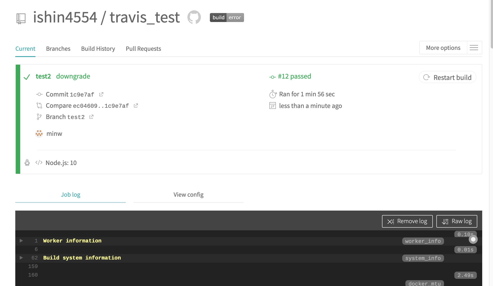

## 十六到二十週心得

這週不小心寫了第二一週完才來補第二十週，這幾週大多屬於複習的內容，也是工具大雜燴，把筆記稍微整理了一下，也來嘗試了 Travis CI。

## week16 
Week16 學的是老朋友 Sass 跟新朋友快取與資料結構，快取透過先預存一些內容在瀏覽器之中加速之後瀏覽的速度，可以透過 header 來設定為什麼存、存多久、因為什麼取消，資料結構也學了 stack 跟 queue，雖然一開始還不是很清楚為什麼要學這個、但下一週馬上就了解到這是 javascript 底層的運作方式。

## week17 
Week17 開始學 javascript 底層原理，滿喜歡學原理的，因為理想上，學會原理應該就可以推理出所有答案，但後來發現 ES 其實是抽象規範，到了落實可能還有很多細節、跟不是很直覺的地方，所以還是要多多練習題目，確定自己有沒有遺漏的部分吧。這次也嘗試了一篇文章的起頭，解決了第一關原理可以怎麼譬喻的問題，剩下的就先放進長長的許願清單。

## week18 
Week18 是工具之週，學 gulp 跟 webpack 一開始摸也是霧煞煞，可能工具用得還不夠多，對於多跑一個 webpack 沒有很直接的感受到他的好，有點依樣畫葫蘆，心想應該之後就會懂這工具的美好（week21 發現了 webpack 的強大）

## week19
Week19 複習網路基礎概念並試寫一個 todo list，這次用 mongo 重寫了 todo list，算是想要嘗試不一樣資料庫，之前試過一次，但大部分時間都在跟 docker 糾結，這次就不管了安裝在 local 端（雖然這樣也是搞了一點時間），deploy 就直接安裝在 ubuntu 裡面。 mongo 語法很直覺，已經有一點 ORM 的感覺，這次也再練習一次寫 .htaccess 檔案做 RESTful API 的實踐，熟能生巧、手能生腳。

## Travis CI 
Travis CI 是自動化發布的一個集合工具，用途是透過撰寫腳本幫助自動執行與部署自己的專案，其實覺得滿好的，在接觸這個工具的時候更加了解開發的流程，一路從安裝環境、寫測試、最後部署也有點像是一個複習回顧背後開發的一條龍。

在 week20 這邊簡單嘗試了一個 Git push 的過程並且要通過 cypress 的測試，原本以為是一個需要安裝在 local 端的服務，殊不知原來他是在虛擬主機上運行也要一點時間，看他還要 booting 的時間，感覺更理想的流程應該是：平常開發的時候在 `npm run start` 穿插 `npm run test` 的開發環境，寫得差不多了就 `npm run build` 測試，最後透過 travis CI commit 做最後確認。由於使用的是新工具，所以遇到了工具會有的 bug，所以開始爬 github issue 發現如果是工具的問題有時候看原本開發的 issue 可能比 stack overflow 收穫要更多，也是滿有趣的一次體驗。

[travis ci 筆記](https://www.evernote.com/l/AYb43vr5vNtOJ6-U_dpsgpvHMwmTQ4x8ogw)

